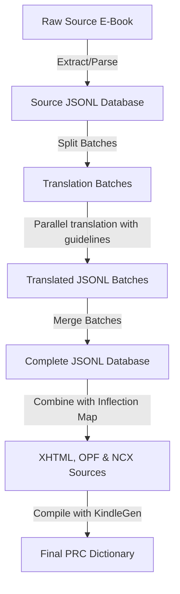

# 📖 Spanish-Hebrew Dictionary Translation & Compilation Pipeline

An automated, production-ready pipeline for converting, translating, and compiling bilingual dictionaries (e.g., Spanish-English) into high-quality, premium Spanish-Hebrew `.prc` dictionaries for Amazon Kindle devices.

The translation engine leverages the official Google GenAI SDK (configured for `gemma-4-31b-it` or `gemini-2.5-flash`), featuring robust concurrency locks, automatic batch-split recovery on API failures, and strict part-of-speech (POS) enforcements.

---

> [!IMPORTANT]
> **LLM Agent-Optimized Repository**
> This repository is fully optimized to be read and executed by **LLM coding agents** (e.g. Claude Code, Cursor, Copilot, Antigravity). It contains a structured agent skill inside [skills/dictionary-translator/SKILL.md](skills/dictionary-translator/SKILL.md). 
> It is **highly recommended** to run this dictionary compilation workflow using an agent, equipping it with the instructions inside that skill directory.

---

## 🏗️ Pipeline Architecture



---

## 🚀 Getting Started

To get the pipeline running on your machine:

1. **Quickstart Installation**:
   Refer to our detailed [Setup & Onboarding Guide](setup_guide.md) to set up your virtual environment, install dependencies, and configure your `.env` credentials.

2. **Verify Configuration**:
   Customize the target metadata and languages in the central configuration file: [config.json](config.json).

3. **Check Test Suite**:
   Confirm your environment is fully operational:
   ```bash
   python -m pytest tests/ -v
   ```

4. **Parse the Dictionary (Format-Specific)**:
   Every raw dictionary has a unique format. Before translating, you must parse the raw source using an existing script in `parsers/` or write a custom parser (by copying `parsers/parser_template.py`). For details, read [parsers/README.md](parsers/README.md) and the [Custom Dictionary Adaptation Guide](custom_dictionary_guide.md).

---

## 📂 Production Modules Reference

Below is the directory list of clean production components:

| Module | Description |
|---|---|
| **[config_helper.py](config_helper.py)** | Central configuration helper that parses [config.json](config.json) and exposes configuration parameters. |
| **`prepare_translation_batches.py`** | Splits the main dictionary entries file (`dictionary_entries.jsonl`) into standard 100-row JSONL batches. |
| **`build_translation_prompt.py`** | Packages prompt templates, guidelines, and batch entries into request payloads. |
| **`translate_batches.py`** | Main translation runner. Features parallel safety, lock files, and rate-limiting throttles. |
| **`import_translated_batch.py`** | Verification gate: corrects Mojibake, strips forbidden characters, resolves POS tags, and runs self-healing LLM correctors. |
| **`merge_translated_batches.py`** | Combines translated batch files into the unified target database. |
| **`build_kindle_dict.py`** | Generates Kindle-compatible XHTML pages, NCX table of contents, and OPF package manifests. Handles complex RTL bi-directional text alignment. |
| **`translation_guidelines.md`** | Quality, grammar, and parts-of-speech guidelines injected into the translator prompt. |
| **[parsers/](parsers/)** | Structured parsing scripts to isolate raw HTML/text parser logic from the main pipeline. |
| **[tests/](tests/)** | Full automated unit and E2E integration test suite. |

---

## 📋 The 4-Field Data Schema

All parsed entries processed by the translation pipeline conform to a clean **4-field data schema**:

1. `entry_id`: Unique numeric identifier (integer).
2. `headword_es`: The original headword (e.g., `"creer"`).
3. `definition_he`: The target Hebrew definition (translated from the source definition).
4. `examples_he` (optional): Hebrew translation of example sentences, separated by ` || ` if multiple examples are present.

---

## ⚡ Execution Overview

Here is a quick command reference. For full documentation of parameters and workflows, read the [Setup & Onboarding Guide](setup_guide.md).

```bash
# 0. Parse the raw source dictionary into normalized JSONL (highly format-dependent)
python parsers/parse_oxford_html.py path/to/raw_source.html --jsonl work/dictionary_entries.jsonl --csv work/dictionary_entries.csv

# 1. Split entries into batches
python prepare_translation_batches.py work/dictionary_entries.jsonl --output-dir work/translation_batches --batch-size 100

# 2. Run translation batches
python translate_batches.py --start-batch 1 --end-batch 10

# 3. Merge batches back into one file
python merge_translated_batches.py --input-dir work/translated_batches --jsonl work/dictionary_es_he.jsonl --csv work/dictionary_es_he.csv

# 4. Generate Kindle XHTML sources
python build_kindle_dict.py --input work/dictionary_es_he.jsonl --output-dir work/kindle_source

# 5. Compile dictionary package using KindleGen
# On Windows:
scratch\kindlegen\kindlegen.exe work\kindle_source\content.opf -o dictionary.prc
# On Linux/macOS:
scratch/kindlegen/kindlegen work/kindle_source/content.opf -o dictionary.prc
```

---

## ⚠️ Pitfalls, Gotchas & Solved Bugs Reference

Future agents and developers should keep these solved layout, translation, and indexing bugs in mind to prevent regression issues:

### 1. Bidirectional (BiDi) RTL Layout Flipping
* **The Gotcha**: Kindle quick-lookup popup windows completely strip HTML `<head>` blocks and CSS stylesheets. 
* **The Pitfall**: This causes Hebrew text to wrap left-to-right, aligning definitions to the left, and flips trailing punctuation or parentheses to the wrong side.
* **The Solution**: 
  * You **must** wrap target definitions and examples in block-level `<div>` elements with explicit inline styles (`dir="rtl" align="right" style="direction: rtl; text-align: right; unicode-bidi: embed;"`).
  * List digits (e.g. `1.`, `2.`) directly preceding RTL text will flip visually (rendering as `.1`). The post-processor injects a **Left-to-Right Mark** (`\u200e` / Unicode 8206) immediately before list digits (e.g., `\u200e1.`) to bound and isolate directionality.

### 2. Arabic Homoglyph Leakage
* **The Gotcha**: Due to training data overlap, LLMs under translation tasks occasionally output Arabic characters that look identical to Hebrew characters in standard monospace console fonts (e.g., Arabic Noon `ن` or Arabic Beh `ب` instead of Hebrew Nun `נ` and Hebrew Bet `ב`).
* **The Pitfall**: This is invisible to the eye but completely corrupts the dictionary index, making search lookups fail.
* **The Solution**: The validation gate in [import_translated_batch.py](import_translated_batch.py) automatically scans for and translates these Arabic homoglyphs back to their Hebrew counterparts.

### 3. POS Markers Polluting Index Keys
* **The Gotcha**: If a raw headword is parsed with its grammatical part-of-speech marker intact (e.g., `"creer v."` or `"abad n."`), it compiles into a search key containing the POS tag.
* **The Pitfall**: Selecting the word `"creer"` in a book highlights only the root word, meaning the search lookup fails to find `"creer v."`.
* **The Solution**: The lookup generator filters out common grammatical markers from index keys using regex and configured lists in [build_kindle_dict.py](build_kindle_dict.py).

### 4. Parallel Concurrency Lock Files
* **The Gotcha**: Running dynamic parallel translator workers can lead to collision bugs where multiple scripts pick up the same batch.
* **The Solution**: Use atomic lock files via `open(lock_file, "x")` to ensure runners claim batches safely. If the server crashes or restarts, **always** clean up stale `.lock` files before restarting the runners to prevent them from skipping pending batches.

### 5. Windows Console CP1252 Mojibake
* **The Gotcha**: Streaming Unicode logs/responses in a Windows terminal environment can corrupt Hebrew characters into CP1252 Mojibake.
* **The Solution**: Ensure UTF-8 system overrides are set in python scripts (`sys.stdout.reconfigure(encoding="utf-8")`) and utilize CP1252 reverse-mapping recovery functions during parsing.

