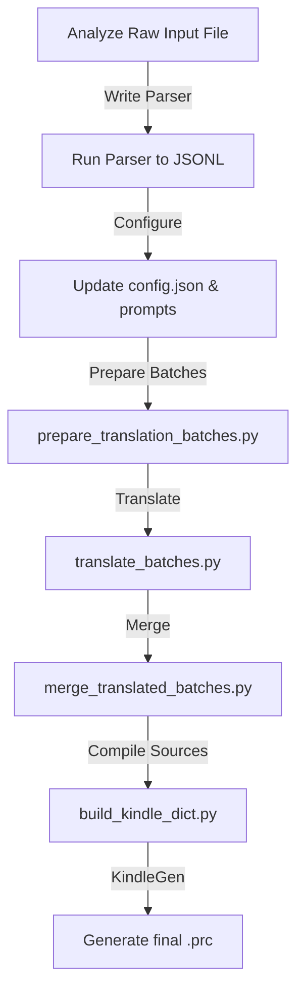

# Dictionary Translation & Compilation Skill

This skill guides an AI agent through the complete end-to-end flow of adapting, translating, and compiling any Lang-English source dictionary (e.g., French-English) into a premium, Kindle-compatible Lang-Hebrew dictionary (e.g., French-Hebrew).

---

## 📋 Process Overview



---

## ⚙️ E2E Implementation Steps

### Step 1: Input Analysis & Custom Parser Setup
1. Identify the format of the raw source dictionary (HTML, XML, TXT, Mobi).
2. Check if a parser for this format exists in `parsers/`. If not, copy `parsers/parser_template.py` to `parsers/parse_<source>_html.py`.
3. Locate the entry delimiter tags (e.g., `<hr/>`, `<mbp:pagebreak/>`) and implement the entry splitting logic.
4. Implement `parse_entry()` to map the source blocks into the standardized schema:
   - `entry_id` (integer)
   - `headword_<src_lang>` (string)
   - `definition_en` (string)
   - `examples_en` (optional string, separated by ` || ` if multiple examples exist)
5. Run the parser with a small `--limit` parameter (e.g., 5 entries) to verify:
   ```bash
   python parsers/parse_<source>_html.py path/to/raw.html --limit 5
   ```
6. Parse the entire dictionary:
   ```bash
   python parsers/parse_<source>_html.py path/to/raw.html --jsonl work/dictionary_entries.jsonl --csv work/dictionary_entries.csv
   ```

### Step 2: Global Configuration & Prompt Customization
1. Open `config.json` and configure:
   - `work_dir` (directory for data)
   - `source_lang.name` and `source_lang.code` (e.g., `"French"`, `"fr"`)
   - `fields`: Ensure mapping matches the parsed JSONL key names.
   - `kindle` metadata: Update title and identifier to prevent conflicts on Kindle.
2. Edit `prompt_templates/translation_no_examples.txt` and `prompt_templates/translation_with_examples.txt`:
   - Change references of `"Spanish"` to the new source language name.
3. Update `translation_guidelines.md`:
   - Replace the few-shot examples with mock translations from your new source language.

### Step 3: Split into Translation Batches
Run the split utility to divide the parsed dataset into 100-row chunks:
```bash
python prepare_translation_batches.py work/dictionary_entries.jsonl --output-dir work/translation_batches --batch-size 100
```

### Step 4: Run Translation Batches
1. Set your `GEMINI_API_KEY` (and optional `GEMINI_API_KEY2`) in `.env`.
2. Run the translator over the target batch range:
   ```bash
   python translate_batches.py --source-dir work/translation_batches --translated-dir work/translated_batches --start-batch 1 --end-batch 10
   ```
   *Note: If running at scale, utilize `start_runners.sh` to spawn parallel workers.*

### Step 5: Merge Translated Batches
Combine completed batch files into a unified database:
```bash
python merge_translated_batches.py --input-dir work/translated_batches --jsonl work/dictionary_es_he.jsonl --csv work/dictionary_es_he.csv
```

### Step 6: Generate Kindle XHTML Sources
Generate Kindle-compatible XHTML part files and manifests:
```bash
python build_kindle_dict.py --input work/dictionary_es_he.jsonl --output-dir work/kindle_source
```
*Note: This automatically reverses Hebrew word order in the generated HTML files to ensure proper alignment in Kindle lookup popups.*

### Step 7: Compile PRC with KindleGen
Compile the OPF package using KindleGen:
```bash
# On Linux/macOS
scratch/kindlegen/kindlegen work/kindle_source/content.opf -o dictionary.prc

# On Windows
scratch\kindlegen\kindlegen.exe work\kindle_source\content.opf -o dictionary.prc
```

---

## 🛠️ Validation & Verification

Always run the test suite to verify pipeline functionality after making configuration or layout changes:
```bash
python -m pytest tests/ -v
```
To verify the visual output layout manually:
1. Open the generated XHTML files (e.g. `work/kindle_source/part_001.html`) in a browser.
2. Verify that definitions and examples are wrapped in `dir="rtl"` and aligned correctly.
3. Verify that Hebrew words are reversed inside text nodes (a requirement for some Kindle rendering engines).
